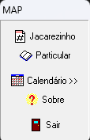
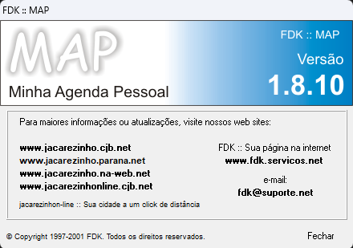
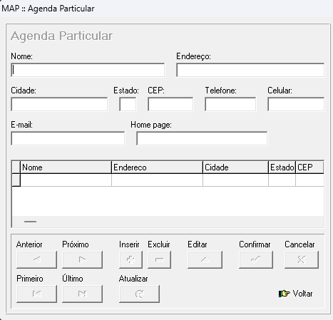

# MAP - Minha Agenda Pessoal

## Descrição

**MAP** (Minha Agenda Pessoal) é uma aplicação desktop clássica desenvolvida em Delphi com foco em gerenciamento de contatos e divulgação de números telefônicos. O projeto foi originalmente criado como uma ferramenta para armazenar e organizar a lista telefônica de números de telefones fixos da cidade de Jacarezinho, servindo também como um sistema de agenda pessoal para gravação e consulta de contatos.

## Informações do Projeto

- **Nome:** MAP (Minha Agenda Pessoal)
- **Versão:** 1.8.10
- **Status:** Descontinuado (2001)
- **Linguagem de Programação:** Pascal (Delphi 6)
- **Banco de Dados:** dBase
- **Plataformas Suportadas:** MS-DOS (original) e Windows (versões posteriores)

## Telas

## Histórico

O projeto MAP teve sua origem na era do MS-DOS e foi posteriormente atualizado para plataforma Windows, acompanhando a evolução tecnológica da época. Desenvolvido em Delphi 6, utilizava a linguagem Pascal e armazenava dados em banco de dados dBase, tecnologias amplamente utilizadas no início dos anos 2000.

## Funcionalidades

- **Gerenciamento de Contatos:** Armazenamento e organização de informações de contato
- **Lista Telefônica:** Divulgação e consulta de números telefônicos fixos
- **Agenda Pessoal:** Sistema intuitivo para gravação de contatos com múltiplos índices de busca

## Licença

Este projeto é fornecido sob licença **Acadêmica e Não Comercial**. O uso deste software é permitido exclusivamente para fins educacionais e não comerciais.

## Notas Histórias

O MAP representa um importante marco no desenvolvimento de aplicações desktop para gerenciamento de informações pessoais, sendo um exemplo de software que evoluiu da era dos sistemas MS-DOS para o ambiente Windows. Embora descontinuado desde 2001, permanece como documentação histórica do desenvolvimento de software em Delphi.

---

*Projeto descontinuado em 2001. Mantido para fins históricos e educacionais.*

** Autor **

Francisco David Kuka <francisco@fdk.com.br>